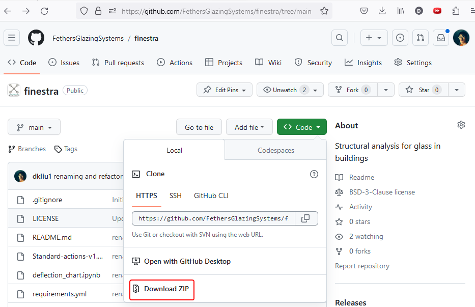

# finestra
-----------

## Structural analysis for glass in buildings
This repository contains:
1. [structure.py](): python module for predicting the behaviour of rectangular glass panels under uniform and concentrated loads using the Navier solution for 4 edge simply-supported flat plate. Permissible design limit for stress and deflection are taken from [AS1288-2021: Glass in buildings – Selection and installation](https://www.agwa.com.au/AGWA/Media/Articles/20210629-TFS-RevisionAS1288.aspx)
2. [deflection_chart.ipynb](): a jupyter notebook that can be served as a [Panel Web App](https://panel.holoviz.org/), which provides a user interface for the deflection calculator.


## Example
Ensure ```structure.py``` is in the python search path
```python
import structure

# a and b are the width and height of the four edge supported panel
a,b = 1000, 1000 
xr_results = structure.wind_pressure_deflection(a,b)

xr_results.to_dataframe().head(10)

```

<table border="1" class="dataframe">  <thead>    <tr style="text-align: right;">      <th></th>      <th></th>      <th></th>      <th></th>      <th></th>      <th></th>      <th></th>      <th></th>      <th>Sratio</th>      <th>Smax</th>      <th>yratio_spacer</th>      <th>yratio_span60</th>      <th>yratio_combined</th>      <th>ymax</th>    </tr>    <tr>      <th>a</th>      <th>b</th>      <th>t</th>      <th>structure</th>      <th>cat_prefix</th>      <th>wind_cat</th>      <th>t_spacer</th>      <th>spacer_ratio</th>      <th></th>      <th></th>      <th></th>      <th></th>      <th></th>      <th></th>    </tr>  </thead>  <tbody>    <tr>      <th rowspan="10" valign="top">1000</th>      <th rowspan="10" valign="top">1000</th>      <th rowspan="10" valign="top">4</th>      <th rowspan="10" valign="top">Roof</th>      <th rowspan="10" valign="top">C</th>      <th rowspan="10" valign="top">C1</th>      <th rowspan="3" valign="top">6</th>      <th>0.333333</th>      <td>0.349386</td>      <td>34.054204</td>      <td>1.023728</td>      <td>0.368542</td>      <td>3.071185</td>      <td>6.142371</td>    </tr>    <tr>      <th>0.500000</th>      <td>0.349386</td>      <td>34.054204</td>      <td>1.023728</td>      <td>0.368542</td>      <td>2.047457</td>      <td>6.142371</td>    </tr>    <tr>      <th>1.000000</th>      <td>0.349386</td>      <td>34.054204</td>      <td>1.023728</td>      <td>0.368542</td>      <td>1.023728</td>      <td>6.142371</td>    </tr>    <tr>      <th rowspan="3" valign="top">8</th>      <th>0.333333</th>      <td>0.349386</td>      <td>34.054204</td>      <td>0.767796</td>      <td>0.368542</td>      <td>2.303389</td>      <td>6.142371</td>    </tr>    <tr>      <th>0.500000</th>      <td>0.349386</td>      <td>34.054204</td>      <td>0.767796</td>      <td>0.368542</td>      <td>1.535593</td>      <td>6.142371</td>    </tr>    <tr>      <th>1.000000</th>      <td>0.349386</td>      <td>34.054204</td>      <td>0.767796</td>      <td>0.368542</td>      <td>0.767796</td>      <td>6.142371</td>    </tr>    <tr>      <th rowspan="3" valign="top">10</th>      <th>0.333333</th>      <td>0.349386</td>      <td>34.054204</td>      <td>0.614237</td>      <td>0.368542</td>      <td>1.842711</td>      <td>6.142371</td>    </tr>    <tr>      <th>0.500000</th>      <td>0.349386</td>      <td>34.054204</td>      <td>0.614237</td>      <td>0.368542</td>      <td>1.228474</td>      <td>6.142371</td>    </tr>    <tr>      <th>1.000000</th>      <td>0.349386</td>      <td>34.054204</td>      <td>0.614237</td>      <td>0.368542</td>      <td>0.614237</td>      <td>6.142371</td>    </tr>    <tr>      <th>12</th>      <th>0.333333</th>      <td>0.349386</td>      <td>34.054204</td>      <td>0.511864</td>      <td>0.368542</td>      <td>1.535593</td>      <td>6.142371</td>    </tr>  </tbody></table>

### Glossary:
- ```Scapacity```: maximum design stress limit
- ```Smax```: maximum stress in the panel caused by ULS wind pressure (MPa)
- ```Sratio```: ratio of Smax/Scapacity
- ```ymax```: maximum panel deflection caused by SLS wind pressure (mm)
- ```yratio_spacer```: ratio of ymax/t_spacer
- ```yratio_span60```: ratio of ymax/(span/60) where ```span = min(a,b)```
- ```spacer_ratio```: maximum yratio_spacer allowed (this a design decision) 
- ```yratio_combined```: maximum of yratio_span60 and yratio_spacer/spacer_ratio

## Installation
### Setup Python environment
Download and install a Python distribution
- [Miniforge](https://github.com/conda-forge/miniforge) with mamba is recommended
- Choose installer appropriate to your OS (e.g. Windows x86_64)

Clone this repository (e.g. download and unzip)



Start miniforge shell by typing
    
    {Win} miniforge {ENTER}

Navigate to the folder containing the code for this repository

    cd c:\Users\<username>\Downloads\finestra

Setup conda environment (e.g. named finestra) via the ```requirements.yml```

    mamba env create -n finestra -f requirements.yml
    
Note that mamba is available in Miniforge from version 23.3.1, for older distributions use

    conda env create -n finestra -f requirements.yml

### Setup web app
Start miniforge shell by typing ```Win miniforge``` then run the following commands

    call C:\ProgramData\Miniconda3\condabin\conda.bat activate finestra

    panel serve deflection_chart.ipynb --port=<port> --allow-websocket-origin=<address>:<port> --address=<address> --prefix=finestra

Create Firewall Inbound Rules to allow connections with the following parameters:
- Programs: 
    - C:\Users\<username>\AppData\Local\miniforge3\envs\finestra\python.exe 
    - C:\Users\<username>\AppData\Local\miniforge3\python.exe
- Protocols:
    - TCP
    - UDP


## References
1. Theory used for the prediction
    - Chapter 5 Simply supported rectangular plates, Equation 132
Timoshenko, S. and Woinowsky-Krieger, S. (1959) Theory of Plates and Shells. 2nd Edition, New York: McGraw-Hill
2. Standard referenced
    - AS1288-2021, Glass in buildings – Selection and installation

